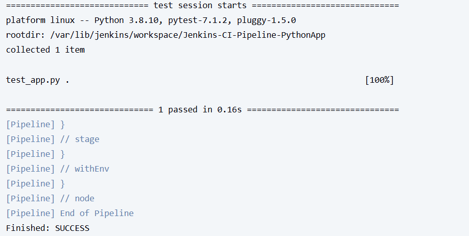

# Jenkins CI Pipeline for Python Flask App
## Overview
This project automates testing of a Python Flask app using a Jenkins CI pipeline, showcasing continuous integration for DevOps workflows.

## Tools Used
- Jenkins
- Python (Flask)
- GitHub

## Setup Instructions
1. Clone the repo: `git clone https://github.com/[your-username]/Jenkins-CI-Pipeline-PythonApp`
2. Install Jenkins and required plugins (Git, Pipeline).
3. Configure a pipeline job with this repo’s `Jenkinsfile`.
4. Run the pipeline to checkout code and execute tests.

## Why CI?
Continuous integration ensures code quality by automating tests on every commit.

## Screenshots

## What I Learned
- Setting up Jenkins pipelines for automated testing.
- Integrating GitHub with Jenkins for CI workflows.
